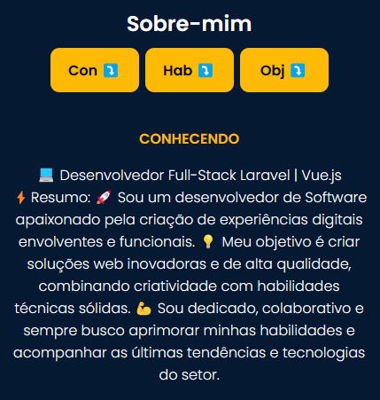
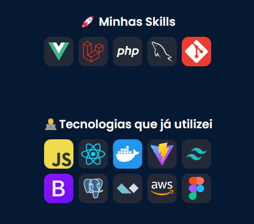

# Sobre o projeto

O Portifólio é uma aplicação Front-End web construída por min com conhecimentos adiquiridos ao longo desses últimos meses estudando programação.

A aplicação consiste em uma Landing page biasica, onde as pessoas possam navegar o site de forma simples e prática, o site também conta com o formato mobile.

## Layout mobile

  
  
  
</di>      

# Tecnologias utilizadas

# Autor

João Félix Santana de Sousa

https://www.linkedin.com/in/joaofelixss
